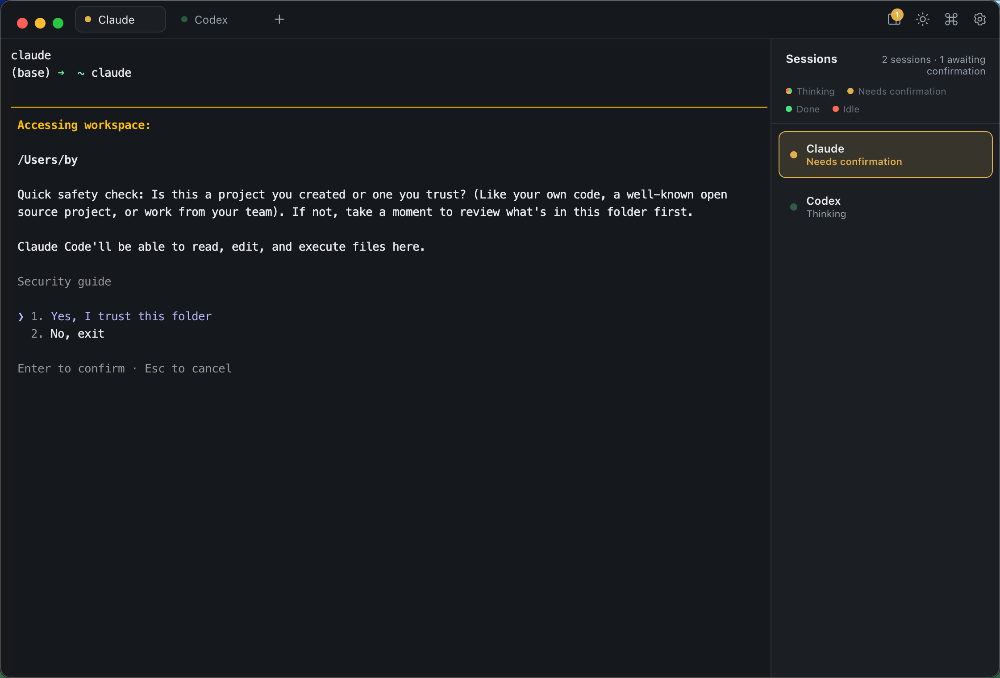

# Byline

**English** | [简体中文](README.zh-CN.md)

**A macOS terminal that watches your AI agents work — and hands sessions between them.**



Run `claude`, `codex`, `cursor-agent` — or any terminal AI agent — each in its own tab,
and let Byline tell you at a glance which one is **thinking**, which is **waiting for
your confirmation**, and which is **done**. Stop babysitting agents: drive several in
parallel and jump in only when one actually needs you. And when a session belongs in
the other model's hands, **hand it off in one click** — Claude ↔ Codex, full context
carried over.

Byline is a *real* terminal underneath, not a wrapper UI: [xterm.js](https://xtermjs.org/)
over a genuine PTY ([node-pty](https://github.com/microsoft/node-pty)) running your own
interactive login `zsh`. Native tab completion, colors, `vim`, `ssh`, your `.zshrc` and
Powerlevel10k prompt — everything just works. The UI ships in 23 languages (English by
default, switchable in Preferences).

> **[⬇ Download Byline](https://github.com/by123/byline/releases/latest)** · `v0.8.1` · macOS · Universal (Apple Silicon & Intel) · signed & notarized

---

## Why

Terminal AI agents are interactive: they stream output for minutes, then silently block
on a `y/n` approval you didn't see. With three agents in three tabs, you either poll the
tabs constantly or discover an hour later that everything stalled on a permission prompt.

Byline turns that inside out. Every session gets a live status — a traffic light per
tab, in the tab strip and a sessions sidebar:

- 🫧 **Thinking** — the agent is actively working; the dot breathes through the
  traffic-light colors
- 🟡 **Needs confirmation** — it paused for you (an approval like `y/n`, `proceed?`, a
  permission request). Background tabs light up with a badge so you can't miss it.
- 🟢 **Done** — the turn finished; output is ready for review
- 🔴 **Idle** — at the shell prompt, nothing running (this agent is free for work)

The sidebar shows a per-session status line and a running tally
(`3 sessions · 1 needs confirmation · 1 done`), so the whole fleet is one glance.

## How status detection works

Three layers, most-authoritative wins, degrading gracefully:

1. **Agent hooks (authoritative)** — agents that support lifecycle hooks (Claude Code
   and Codex) report their state through a tiny file-based protocol: write one word
   (`think` / `confirm` / `done` / …) to `/tmp/byline_sessions/$BYLINE_SID`. Exact,
   instant, per-tab. The bundled hook and a one-command installer for both live in
   [`hooks/`](hooks/) — see [hooks/README.md](hooks/README.md) for the full protocol.
2. **Shell integration (exact command lifecycle)** — Byline loads via `ZDOTDIR`, sources
   your real z-files, then adds OSC 133 markers: `preexec` = a command started, `precmd`
   = back at the prompt. This gives a precise **running vs idle** signal for *any*
   program, not just agents.
3. **Output heuristics (fallback)** — while a command runs, sustained output means
   *thinking*; output going quiet with an approval-looking tail (`y/n`, `proceed?`,
   `❯` menus…) means *needs confirmation*. Patterns live in `renderer/index.html`
   (`WAIT_RE`) and are easy to tune.

Sessions with hook-driven status ignore the heuristics entirely; when the agent process
exits, control hands back to the shell-integration layer automatically.

### Enable authoritative status for Claude Code & Codex

```bash
cd hooks
./install.sh     # registers the byline-status hook in ~/.claude/settings.json
                 # and ~/.codex/hooks.json (a config that isn't present is skipped)
```

The hook is a no-op outside Byline, adds ~no latency (async, dependency-free POSIX sh),
and `./install.sh --uninstall` removes it cleanly. The same hook payload also binds each
**agent handoff** to the exact tab you clicked, even when two tabs share one project
directory. Codex gates new hooks behind a one-time review — on the next `codex` launch,
choose **"Trust all and continue"**. Any other agent that can run a command on lifecycle
events can use the same script — the protocol is agent-agnostic.

## Agent handoff: move a session between agents, context included

The other thing Byline is built around. Sometimes the model you started with isn't
the one to finish the job — Claude hits a usage limit mid-refactor, Codex is stuck and
you want a second opinion, or you simply want the other model's take on a plan.
Instead of copy-pasting context into a fresh session, right-click a running `claude`
or `codex` session (in the terminal area or on its sidebar row) →
**Hand off to Codex… / Hand off to Claude…**, and the other CLI takes over the work:

1. The source session's transcript is archived to `~/.byline/handoffs/<stamp>/`,
   out of reach of both CLIs' retention cleanup.
2. The *source* model distills its own session into a structured handoff summary
   (goal, key decisions, files touched, next steps) — via
   `claude -p --resume --fork-session` or `codex exec resume`, so the live session
   file is never touched.
3. A fresh tab launches the target CLI with an intro prompt pointing at the summary
   and the raw archive, and it continues the remaining work directly.

Every step runs visibly in the new tab's terminal, and chained handoffs
(Claude → Codex → back to Claude) work too. Summary and intro prompts follow the UI
language.

## A real terminal

- **node-pty** — each tab is a genuine interactive login `zsh`; `vim`, `ssh`, `tmux`,
  completions and your prompt all behave exactly as in Terminal.app
- **xterm.js + WebGL renderer** — fast rendering that keeps up with agent output, with
  crisp box-drawing glyphs (Claude Code's `╭─╮` frames) at any line height
- **Flow control** — PTY output is coalesced per frame and back-pressured, so a runaway
  `cat` of a huge file can't freeze the UI
- **Files → paths** — ⌘V a file copied in Finder, or drag files onto the window, and the
  shell-quoted full path is inserted (like Terminal.app)
- **Links & clipboard** — plain-text URLs and OSC 8 hyperlinks are clickable (opening in
  your default browser), OSC 52 lets `tmux`/`nvim`/`ssh` copy to your clipboard
- **Search** (`⌘F`), Unicode 11 width handling, 8000 lines of scrollback, light/dark themes

## YOLO mode: run without the confirmation prompts

Some work you just want to let rip. Byline ships two extra quick-launch commands for it —
**Claude Yolo** (`⌘O`) and **Codex Yolo** (`⌘P`) — that start the agent with its permission
gate dropped (`claude --dangerously-skip-permissions`,
`codex --dangerously-bypass-approvals-and-sandbox`).

A YOLO session is meant to run end to end without stopping, so Byline drops its
auto-confirm helper into it automatically: on any prompt the CLI still shows, Enter is
pressed for you. Any command you add yourself that carries a bypass flag (`--yolo`,
`--permission-mode bypassPermissions`, …) is recognized as YOLO the same way.

Both launchers also live in the right-click menu — on a sidebar session row and in the
terminal — so you can start one in the current directory without touching the keyboard.
A checkbox in Preferences (**Show YOLO sessions in the right-click menu**) hides them if
you'd rather keep the menu lean.

> **Heads up:** a bypass flag lets the agent run commands and edit files with no approval.
> Use YOLO sessions only where you're comfortable with that.

## Working with many sessions

- **Quick-launch commands** — configurable label + command + shortcut (defaults:
  `⌘N` Claude, `⌘M` Codex, plus `⌘O` / `⌘P` for their YOLO variants); they appear in the
  app menu and the command palette
- **Open in the same directory** — new sessions inherit the current tab's working
  directory by default, so a new tab lands where you're already working (toggle in Preferences)
- **Command palette** (`⌘K`) — every action and quick-launch, fuzzy-filtered
- **Per-session quick prompts** — right-click a sidebar row to send a saved prompt
  ("continue", "commit my changes", …) straight into that session, without switching tabs
- **Right-click menu in the terminal** — copy/paste plus the same quick prompts, handoff
  actions, and YOLO launchers, right where you're working
- **Chrome-style tabs** — drag to reorder, double-click to rename, right-click for
  close-others / close-right
- **Configurable shortcuts** — every action and quick command is rebindable in
  Preferences (`⌘,`)

### Keyboard

| Shortcut | Action | Shortcut | Action |
| --- | --- | --- | --- |
| `⌘T` | New tab | `⌘B` | Toggle sidebar |
| `⌘W` | Close tab | `⌘K` | Command palette |
| `⌘N` / `⌘M` | New Claude / Codex | `⌘F` | Search scrollback |
| `⌘O` / `⌘P` | New Claude / Codex (YOLO) | `⌘1…9` | Switch tab (visual order) |
| `⌘+ / ⌘- / ⌘0` | Font size | `⌘R` | Rename tab |
| `⌘,` | Preferences | | |

Everything else goes straight to the shell.

---

## Install

**[Download the latest release](https://github.com/by123/byline/releases/latest)** — a
signed, notarized DMG: open it, drag Byline into Applications, done. No Gatekeeper
warnings. Universal binary — one download for Apple Silicon and Intel Macs
(macOS 10.15+).

### Build from source

```bash
git clone https://github.com/by123/byline.git
cd byline/byline-app
npm install       # first time only
npm run rebuild   # first time only: builds node-pty against Electron's ABI
npm start         # run in development
```

Build and install your own `Byline.app`:

```bash
npm run package   # unsigned local build -> dist/Byline-darwin-arm64/Byline.app
npm run deploy    # package + install into /Applications (removes quarantine)
```

Source builds are unsigned; if Gatekeeper blocks a double-click, right-click → **Open**
once. Requirements: Node.js ≥ 20, Xcode Command Line Tools (for the node-pty rebuild).
Maintainers: `npm run release` produces the signed + notarized DMG — see
[byline-app/RELEASING.md](byline-app/RELEASING.md).

## Repository layout

```
byline-app/            The Electron app
├── main.js            Main process: PTY sessions, status-file watcher, agent handoff, app menu
├── preload.js         Sandboxed, context-isolated window.byline bridge
├── renderer/
│   ├── index.html     xterm.js UI: tabs, sidebar, status state machine, palette
│   └── vendor/        Vendored xterm.js + addons (no CDN at runtime)
├── shell/             ZDOTDIR z-files: source the user's config + OSC 133 markers
└── build/             App icon

hooks/                 The status protocol + agent hooks (see hooks/README.md)
├── byline-status      Dependency-free POSIX sh hook: one word -> one status file
└── install.sh         One-command install/uninstall for Claude Code + Codex

byline-terminal/       Early single-file HTML design prototype (reference only)
```

## Roadmap

- Hook adapters for more agents out of the box
- More handoff targets beyond `claude` ↔ `codex` (e.g. `cursor-agent`, `gemini`)
- Split panes; session persistence across launches
- Homebrew Cask
- Tune per-agent "needs confirmation" patterns from real-world usage

## Contributing

Issues and PRs are welcome. The codebase is intentionally small — three files of app
code, no framework — so most changes are an afternoon, not an architecture. If an
agent's status is detected wrong, an issue with a copy of the terminal tail is enough
to tune the patterns.

## License

[MIT](LICENSE)
